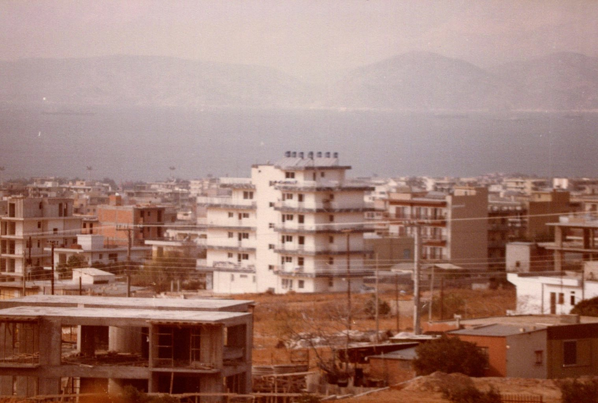
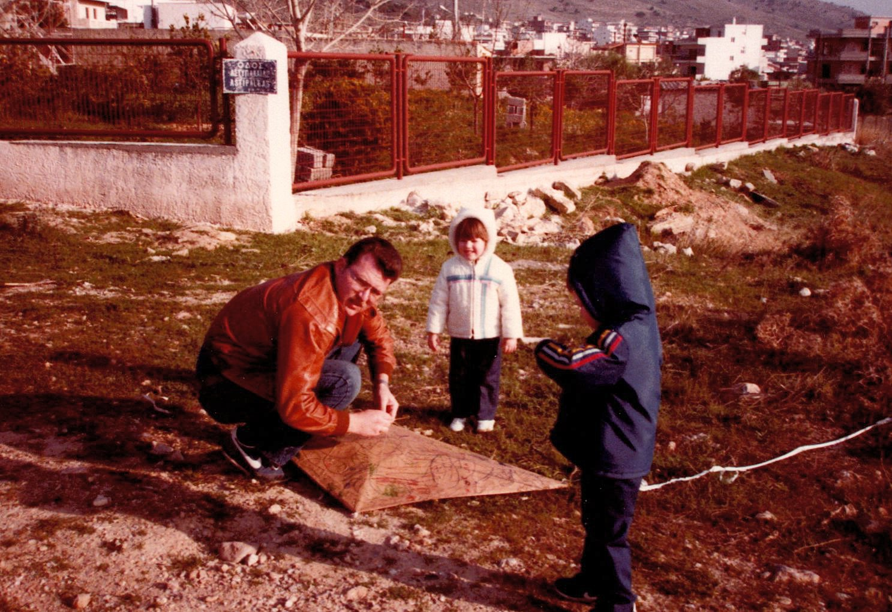
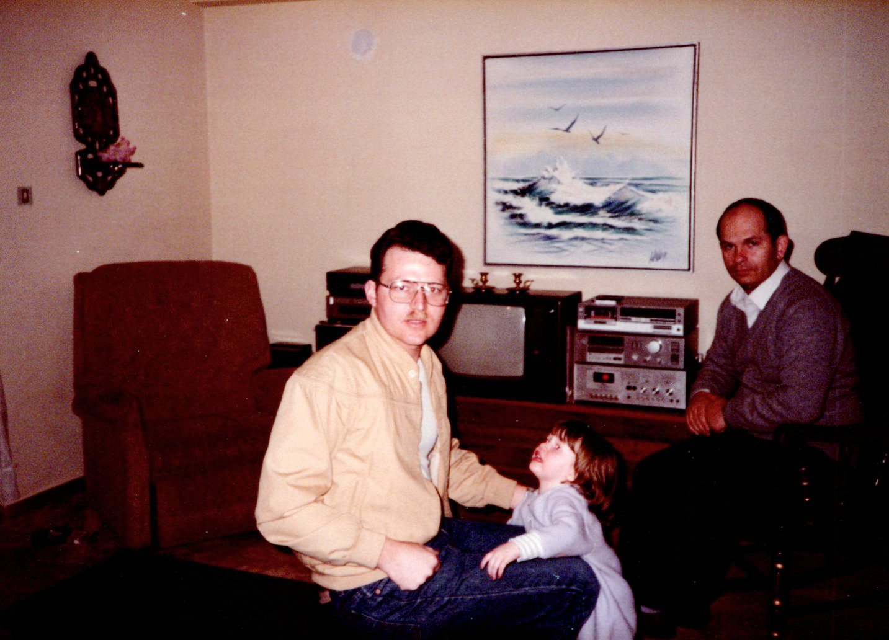
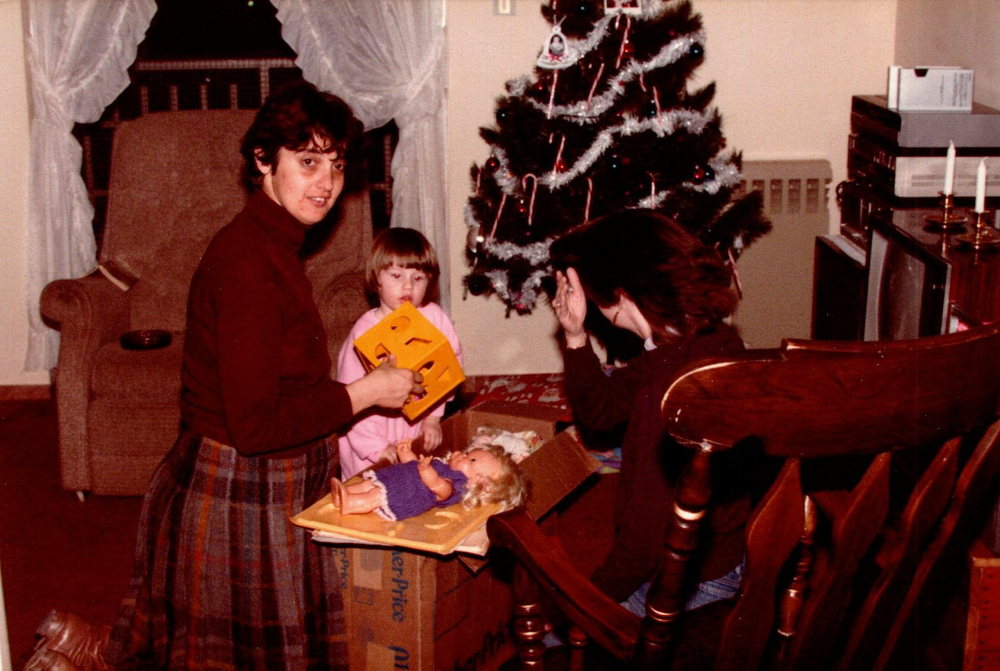
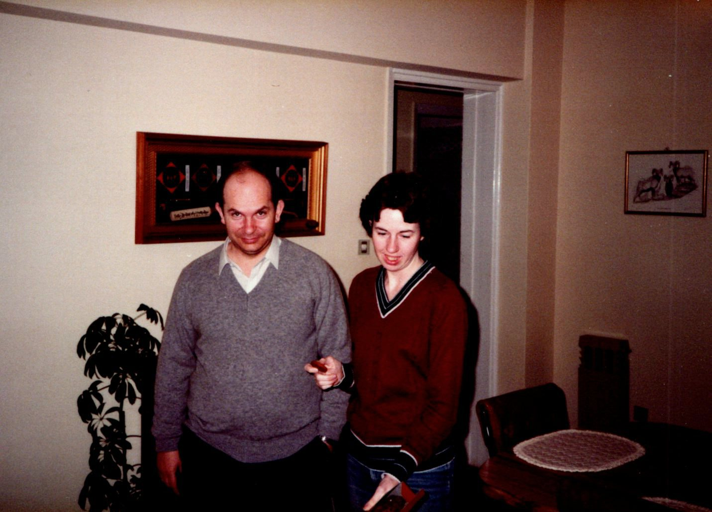
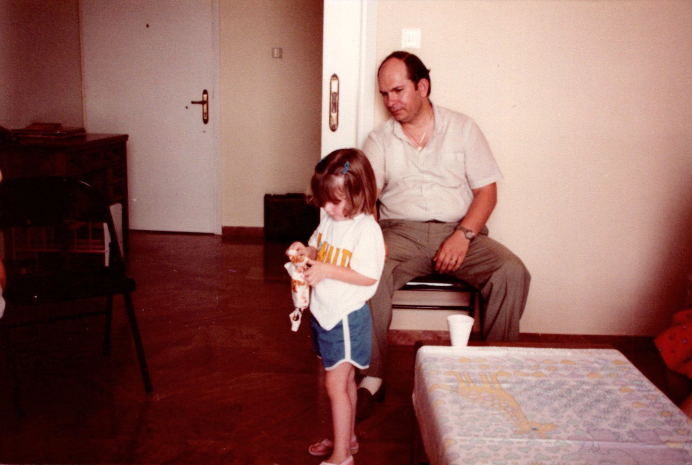

# John, Georgia, and Irene Papadopoulos

Hi. I'm looking for John, Georgia, and Irene Papadopoulos from Ano Glyfada Greece in 1986.

I, Chuck King, served in the US Air Force at Hellenikon Air Base, Greece, from Jan 1984 until Oct 1986. During that time, we lived in a six story appartnment building at the corner of Pithagora and Nisuru, in Ano Glyfada, Greece. We lived on the fourth floor, facing the sea. John and Georgia lived on the fourth floor, facing the mountains. While we were there, John and Georgia had a daughter, Irene.

 Our appartment building back then.

 Our appartment building the last time Google Maps scanned it.

John and Georgia were the only Greek people living in the building, as the rest of the appartments were occupied by Americans. It was my understanding that this was because many of the landlords would charge Americans as much as double the rent that they could charge locals. I also believe that the owner of the building, also named (John?) Papadopoulos, was somehow related to John, my neighbor, and through the family connection, was subjected to allowing neighbor John to live there for a normal Greek rent.

The owner of the building had been in Austrailia for something like 20-plus years and had returned to Greece to invest his earnings in real estate. He was a pretty nice guy, also, and I enjoyed talking to him when he was around. He worked at Olympic Airways and dropped by every few days to try his best to keep track of the contractors he had coming to do something on the building. When we moved in, the appartments were finished, but the ground-floor store area, parking area, fence, and landscape were not started/done. So, basically, he was working toward getting those done the entire time we lived there. He used to get quite pissed off when he would take a day off and show up and the contractor that promised to be there wouldn't show at all. This wasn't an uncommon occurance (avrio, avrio).

Back to our neighbors, John worked somewhere near Athens and Georgia worked as a translator, I think. They were both super nice people and loved chatting in English (John was trying to learn English) and playing with our kids. They didn't make much money and lived a modest lifestyle, but were good people and loved life.

John was from the Peloponnese, or at least his parents lived there. I went on a trip there one time with him to visit them. They had a small bit of land (couple/few acres?) and had quite a few apple trees. I remember that there were hundreds of apples basically tossed in a big pile under their porch as a stash for the winter. I also recall that John's mom made some kind of (intestine?) stew that was absolutely terrible to my junk-food pallet, but to be gracious, I ate it and thanked them. His parents were absolutely welcoming and wonderful.

Speaking of food experiences, one time John gave us a chunk of cheese that his mom had made and it seemed like the best cheese I had ever tasted. I mean, it was pretty great. So, some months later, John said he was going to make some and asked if I wanted to see how it was done. I of course said yes, and went over to his appartment. It was a super simple process, but depended upon fresh Greek ingredients. About two years ago, I spotted some of that cheese at Costco down in Tennessee and grabbed it. Ah, such a sweet memory. It was [Manouri Cheese](https://www.thespruceeats.com/manouri-greek-cheese-1705634).

Also, while we were living there, John and Georgia brought one of their grandfathers to live with them. He was super old and didn't speak a bit of English (and I didn't speak a bit of greece short of hello), so we never chatted. However, I loaned him an old recliner for a while and he absolutely loved that chair. He spent most of his days sitting in it.

I remember how much joy John and Georgia had when they found out Georgia was pregnant. Georgia, with her big ole belly, would sing and dance down the road, twirling and laughing, just giddy that she was going to have a baby. Once Irene got there, they were so happy, and went into full parent mode.

Some of our conversations were about things they/we noticed about Americans/Greeks. We would ask about words, or food, or things we saw people do so we could try to learn about the item or the culture.

One time we were over at their appartment and John was playing with Irene. He noticed that she pooped, so he yelled out to the kitchen for Georgia to come and change her. My wife, Judy, said, "Hey, parenthood is a 50/50 arrangement, so there is no reason that Georgia should have to stop what she is doing to come and change her. You are the dad, so you can just change her." Georgia had just arrived when Judy said that and she had a surprised, but smiling look on her face, as she looked at Judy and then looked back at John. John looked at them both, then turned to me and said, "Chuck, you should take your woman home before she gives my wife bad usuals!" (meaning habits). Then, he looked around the room and busted up laughing. He was joking about my culture poluting his. We all laughed.

We left Greece before Irene was big enough to remember anything, but I'm including her here because she might be interested in these stories, and because she might be the one to find this info and reach out.

This is at the next corner over, on Astipaleas. It's me, my daughter Lisa, and my son, Chip, trying to fly a home-made kite.

 Me, Lisa, and John in our appartment.

 Georgia, Lisa, and Judy in our appartment.

 John and Judy.

 Lisa and John.

I tried doing some internet and Facebook searching a few years ago, but can't seem to find any info on John, Georia, or Irene. So, if anyone sees this and knows how to contact them, please contact me at cwkingjr |@| gmail.
